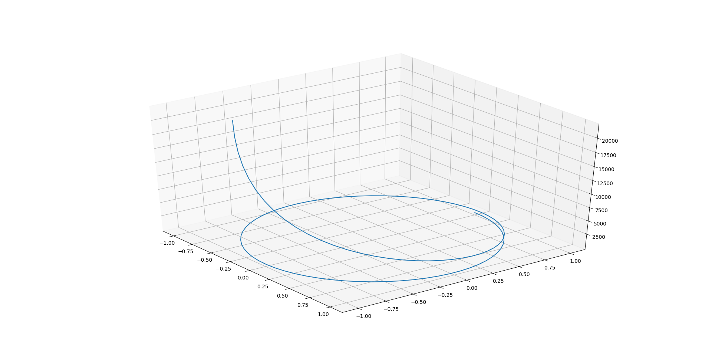
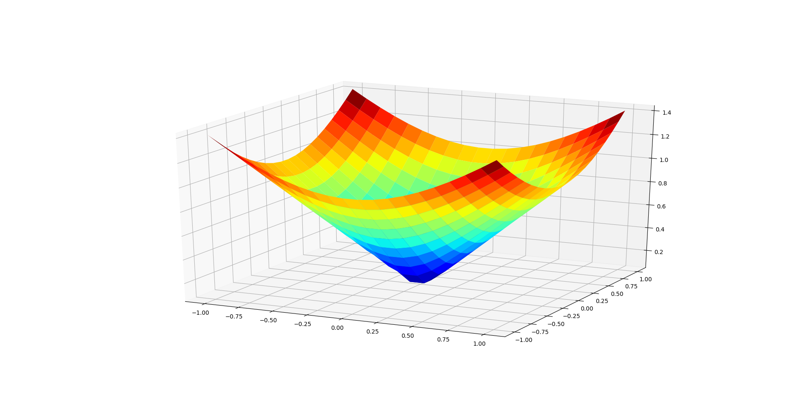
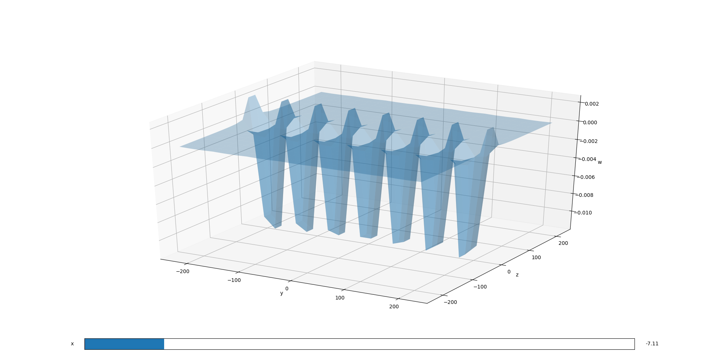
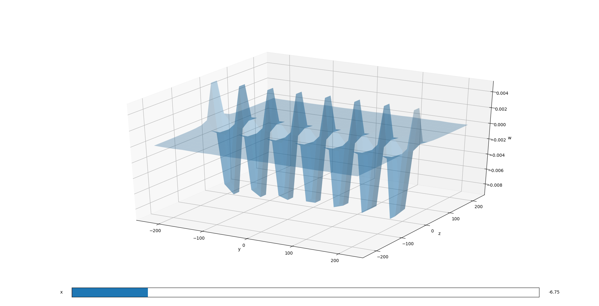
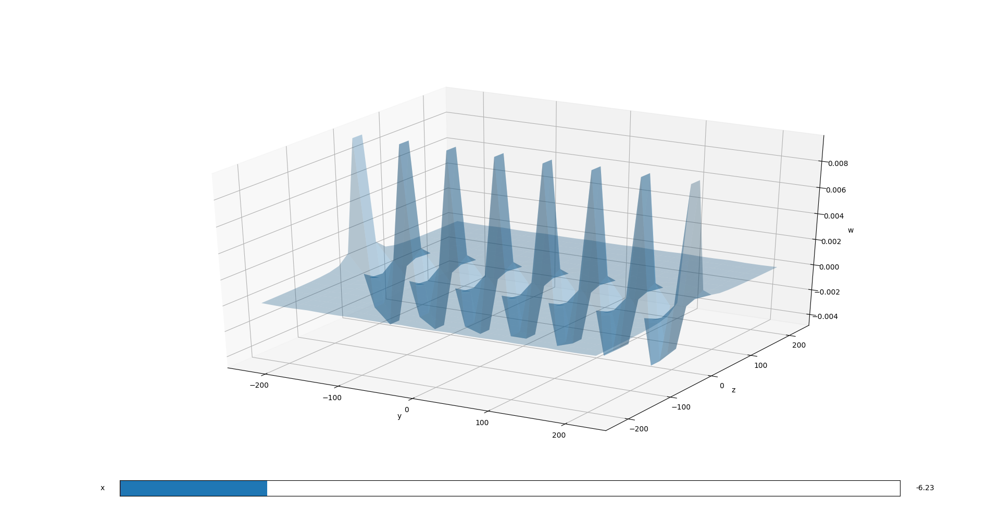
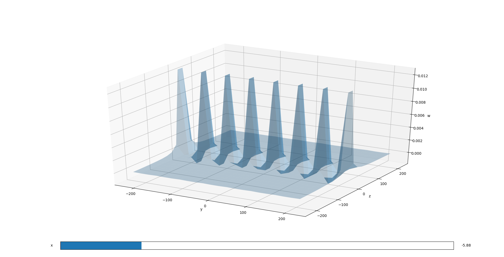

# Charts

## Plot3d.param()
```python
import numpy as np
from hal.charts.plotter import Plot3d

Plot3d().param(
    np.sin, np.cos, np.exp,  # x, y, z axis function
    0, 10, 100  # from 0 to 10 using 100 points
)
```



## Plot3d.plot()
```python
import numpy as np
from hal.charts.plotter import Plot3d

def f(x, y):  # sample function
    return np.sqrt(np.power(x, 2) + np.power(y, 2))

Plot3d().plot(
    f,
    -1, 1, 20,  # min, max and number of points of x axis
    -1, 1, 20  # min, max and number of y axis
)
```



## Plot4d.plot()
```python
import numpy as np
from hal.charts.plotter import Plot4d

def f(x, y, z):
    return (np.sin(x) + np.cos(y)) / (np.power(z, 2))

Plot4d().plot(
    f,
    -10, 10,  # min and max of x axis
    -10, 10,  # min and max of y axis
    -10, 10,  # min and max of z axis
    precision=0.1, kind="slice"
)
```






## Questions and issues
The [github issue tracker](https://github.com/sirfoga/pyhal/issues) is **only** for bug reports and feature requests. Anything else, such as questions for help in using the library, should be mailed [here](mailto:sirfoga@protonmail.com).
